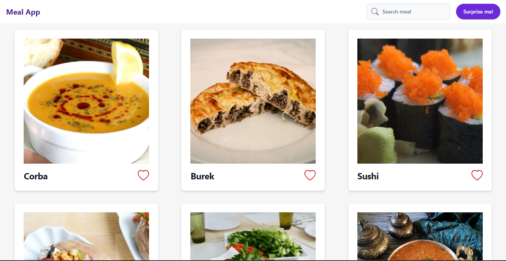

# Meals app

## Screenshot


Web page where you can see different foods, add them to favorites, see more information about the food you select, it has a search engine and you can get a random meal by clicking on the surprise me button. This project makes use of the react context to pass data through the component hierarchy without having to manually pass props at each level.

### Built With
* 
* 
* Flowbite
* React-icons
* Axios

## Installation
Clone project 
```
  git clone https://github.com/Brayanro/meals-app.git
```

Install dependencies
```
  yarn install or npm install
```

Run proyect in development
```
  yarn dev or npm run dev
```

## Contact
(mailto:brayan7890123@gmail.com)